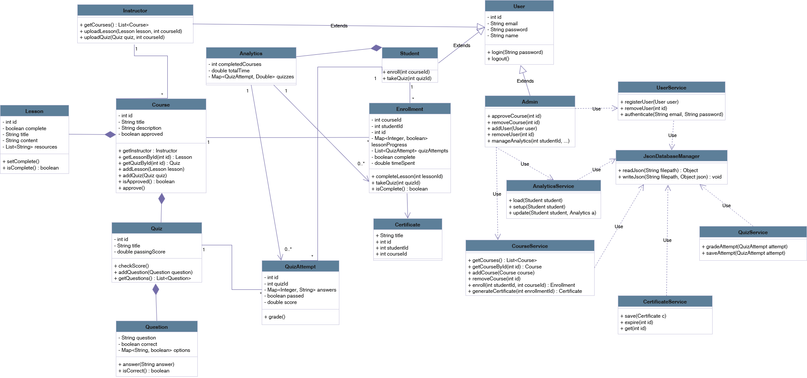

# SkillForge-UML-Design
SkillForge is an online collaborative learning platform supporting Students, Instructors, and Admins. The system manages courses (lessons & quizzes), enrollments, certificates, and analytics; all data is persisted in JSON and accessed via service classes and a JsonDatabaseManager.

## Class Diagram

by [@acskii](https://github.com/acskii) - Andrew Sameh Adel Mikhail - **ID 9489**  

*(Subject to change - 31/10/2025)*

## Sequence Diagram

by [@Hassanmo-20](https://github.com/Hassanmo-20) - Hassan Mohamed - **ID 9635**

This **Sequence Diagram** represents the process of a student enrolling in a course on the SkillForge platform. It shows how the UI, Service, and Database interact to check if the student is already enrolled, fetch course information, and respond accordingly. This diagram is important because it clarifies the system’s logic and communication flow, ensuring all components work together correctly during enrollment.
